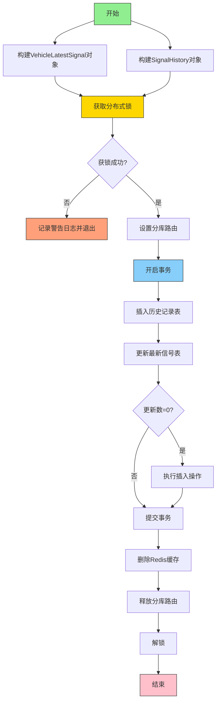
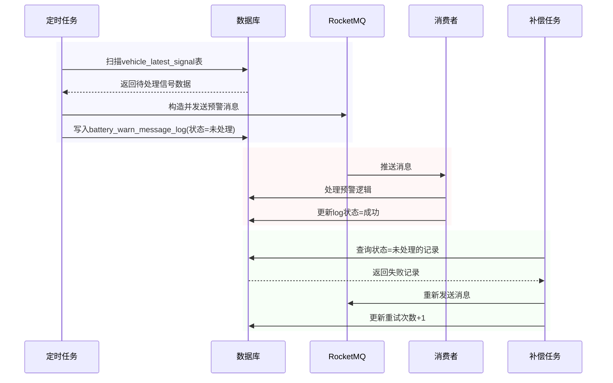
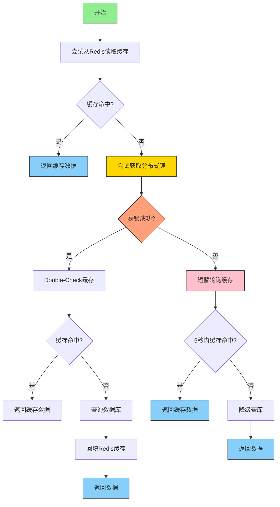

# 大作业

## 1.github

github地址：

```shell
https://github.com/cugljc/xiaomi.git
```


## 2.数据库表的设计


### 2.1 建库建表

分成两个三个库，

1. 默认库存储预警规则表、任务补偿表
2. 其余两个库，采用分库分表的策略，**以carId为路由字段**，每个库包含：
   1. 1个车辆信息表
   2. 1个最新状态表
   3. 4个全量状态表

#### 2.1.1 默认库

##### 预警规则表

```sql
CREATE DATABASE IF NOT EXISTS warning_rules_db;
USE warning_rules_db;

CREATE TABLE warning_rules (
    id            INT              AUTO_INCREMENT PRIMARY KEY,
    warn_code     TINYINT          NOT NULL COMMENT '1=电压差, 2=电流差',
    battery_type  VARCHAR(32)      NOT NULL,
    warn_level    TINYINT          NOT NULL COMMENT '报警等级',
    min_val       FLOAT            NOT NULL COMMENT '>= min_val',
    max_val       FLOAT            DEFAULT NULL COMMENT '< max_val，NULL 表示∞',
    warn_name     VARCHAR(64)      NOT NULL COMMENT '规则/预警名称',
    UNIQUE KEY uk_rule (warn_code, battery_type, warn_level)
) ENGINE=InnoDB DEFAULT CHARSET = utf8mb4;
```

------

存储预警规则，每个预警码、电池类型、预警级别组成一个唯一索引，本质是将不同级别的规则拆分成多条

##### 任务补偿表

```sql
CREATE TABLE battery_warn_message_log (
    id BIGINT AUTO_INCREMENT PRIMARY KEY,
    car_id INT NOT NULL,
    payload TEXT NOT NULL,
    status TINYINT DEFAULT 0,   -- 0=待处理，1=成功，2=失败
    retry_count INT DEFAULT 0,
    last_retry_time DATETIME,
    create_time DATETIME DEFAULT CURRENT_TIMESTAMP
);

```

**用于记录mq消息的发送状态与重试信息，保障任务在失败后能够进行补偿处理，确保系统最终一致性。**

#### 2.1.2 其余两个库：

### 2.1.2 车辆信息表（分库分表）

```sql
CREATE DATABASE IF NOT EXISTS vehicle_db_01;
USE vehicle_db_01;

CREATE TABLE vehicle_info (
    id                BIGINT UNSIGNED AUTO_INCREMENT PRIMARY KEY COMMENT '自增主键',
    carid             INT UNSIGNED NOT NULL UNIQUE COMMENT '全局唯一车架号（数字型）',
    vid               CHAR(16)      NOT NULL UNIQUE COMMENT '车辆识别码（16位随机字符）',
    battery_type      VARCHAR(32)   NOT NULL COMMENT '电池类型',
    total_mileage_km  INT          NOT NULL COMMENT '总里程（km）',
    health_pct        TINYINT      NOT NULL COMMENT '电池健康状态（%）',
    INDEX idx_carid (carid) COMMENT '车架号索引'
) ENGINE=InnoDB DEFAULT CHARSET=utf8mb4;
```

#### 2.2 最新状态表（分库分表）

```sql
USE vehicle_db_01;

CREATE TABLE vehicle_latest_signal (
    id                BIGINT UNSIGNED AUTO_INCREMENT PRIMARY KEY,
    carid             INT UNSIGNED NOT NULL COMMENT '数字车架号',
    warn_code         TINYINT      NOT NULL COMMENT '1=电压差,2=电流差',
    warn_name         VARCHAR(64)  NOT NULL COMMENT '预警类型',
    warn_level        TINYINT      NOT NULL COMMENT '报警等级',
    battery_type      VARCHAR(32)  NOT NULL COMMENT '电池类型',
    signal_data       JSON         NOT NULL COMMENT '信号数据 (mx/mi 或 lx/ii)',
    last_updated      TIMESTAMP    NOT NULL DEFAULT CURRENT_TIMESTAMP 
                                    ON UPDATE CURRENT_TIMESTAMP,
    UNIQUE KEY uk_carid_warncode (carid, warn_code),
    KEY idx_carid (carid)
) ENGINE=InnoDB DEFAULT CHARSET=utf8mb4;
```

这里因为采取了分库分表策略，**为了避免跨表和跨库的join，将查询所需的所有字段冗余到一张表里**

状态表包括：数字车架号、预警类型、报警等级、电池类型以及信号数据

1. 如果最新状态表不分库，每次插入状态时需要先路由一次，插入历史表，
2. 再清除路由库，到默认库插入最新状态表，操作繁琐；

分库的话，根据路由字段计算出对应的库，在一个事务里同时插入或更新两个表即可，

#### 2.3 全量状态表(（分库分表+分区)

```sql
USE vehicle_db_01;

-- signal_history_000
CREATE TABLE signal_history_000 (
    id                BIGINT UNSIGNED AUTO_INCREMENT,
    carid             INT UNSIGNED NOT NULL COMMENT '数字车架号',
    warn_code         TINYINT      NOT NULL COMMENT '1=电压差,2=电流差',
    warn_name         VARCHAR(64)  NOT NULL COMMENT '预警名称',
    warn_level        TINYINT      NOT NULL COMMENT '报警等级',
    battery_type      VARCHAR(32)  NOT NULL COMMENT '电池类型',
    signal_time       DATETIME     NOT NULL COMMENT '信号时间',
    signal_data       JSON         NOT NULL COMMENT '原始信号数据',
    PRIMARY KEY (id, signal_time),
    UNIQUE KEY uk_carid_warncode_time (carid, warn_code, signal_time),
    INDEX idx_carid_time (carid, signal_time)
) ENGINE=InnoDB DEFAULT CHARSET=utf8mb4
PARTITION BY RANGE (TO_DAYS(signal_time)) (
    PARTITION p20250625 VALUES LESS THAN (TO_DAYS('2025-06-26')),
    PARTITION p20250626 VALUES LESS THAN (TO_DAYS('2025-06-27')),
    PARTITION p20250627 VALUES LESS THAN (TO_DAYS('2025-06-28')),
    PARTITION p20250628 VALUES LESS THAN (TO_DAYS('2025-06-29')),
    PARTITION p20250629 VALUES LESS THAN (TO_DAYS('2025-06-30')),
    PARTITION p20250701 VALUES LESS THAN (TO_DAYS('2025-07-01')),
    PARTITION p20250702 VALUES LESS THAN (TO_DAYS('2025-07-02')),
    PARTITION pMax      VALUES LESS THAN MAXVALUE
);


-- signal_history_001 / 002 / 003 同理，仅表名不同
```

1. **为什么要分区**：当数据量很大(时，肯定不能把数据再如到内存中，这样查询一个或一定范围的item是很耗时。另外一般这情况下，**历史数据或不常访问的数据占很大部分，最新或热点数据占的比例不是很大**。这时可以根据有些条件进行表分区。分区后查询范围命中对应分区，**无需全表扫描**，性能大幅提升.

2. 分区后如何清除旧的历史数据，并添加新的日期分区

   ```sql
   ALTER TABLE signal_history_000
   ADD PARTITION (
       PARTITION p20250703 VALUES LESS THAN (TO_DAYS('2025-07-04'))
   );
   
   ALTER TABLE signal_history_000 DROP PARTITION p20250625;
   ```

## 3.系统设计

### 3.1 上报功能实现

#### 3.1.1 预警规则装配


整体步骤如下：

1. **获取预警规则**：

   - 从Repository获取所有预警规则实体（`WarnRuleEntity`）
   - 按`电池类型_告警代码`分组（如"三元电池_1"），这种分组方式可以保证全局唯一

2. **规则处理阶段**：

   - 对每组规则：
     - 计算该组的极值，这个极值指的是(x,无穷)这个x的值
     - 离散化数值区间（步长0.1），每一步与对应的warnlevel相对应

3. **存储阶段**：

   - 将离散化后的规则存入Redis Hash
   - 存储极值和最大告警级别

   


采用空间换时间的思想，避免逐个匹配，将时间复杂度降至O(1)。这样通过提前把预警规则装配到redis hash，有两点好处。

1. 第一降低时间复杂度，避免信号上报时，临时从库表读取规则再解析，并且还要一一匹配，太浪费时间
2. 可以通过动态更改库表，实现动态配置规则


整体的代码实现如下：

```java
/**
 * ClassName: RuleArmory
 * Package: com.xiaomi.domain.battery.service.armory
 */
@Slf4j
@Service
public class RuleArmory implements IRuleArmory {
    @Resource
    IBatteryRepository batteryRepository;

    @Override
    public void assembleRules(){

        List<WarnRuleEntity> warnRuleEntities=batteryRepository.queryWarnRuleList();
        // 1. 按电池类型和告警代码分组
        Map<String, List<WarnRuleEntity>> groupedRules = warnRuleEntities.stream()
                .collect(Collectors.groupingBy(
                        rule -> String.format("%s_%d",
                                rule.getBatteryType(),
                                rule.getWarnId())
                ));

        int precision=1;
        float epsilon = 0.01f;
        // 2. 处理每组规则
        groupedRules.forEach((groupKey, ruleList) -> {
            // 初始化存储结构
            Map<String, String> redisHash = new HashMap<>();
            float groupMin = Float.MAX_VALUE;
            float groupMax = Float.MIN_VALUE;
            int maxWarnLevel = Integer.MIN_VALUE;
            // 3. 处理每条规则
            for (WarnRuleEntity rule : ruleList) {
                // 更新极值
                groupMin = Math.min(groupMin, rule.getMinVal());
                groupMax = Math.max(groupMax, rule.getMinVal());
                maxWarnLevel = Math.max(maxWarnLevel, rule.getWarnLevel());
                // 离散化区间
                if (rule.getMaxVal() == null) {
                    // 无限区间特殊处理
                    redisHash.put(String.valueOf(rule.getMinVal()),
                            String.valueOf(rule.getWarnLevel()));
                } else {
                    // 常规区间离散化
                    float step = (float) Math.pow(10, -precision);
                    for (float v = rule.getMinVal(); v < rule.getMaxVal()-epsilon; v += step) {
                        String key = String.format("%.1f", v); // 保留1位小数
                        redisHash.put(key, String.valueOf(rule.getWarnLevel()));
                    }
                }
            }
            batteryRepository.storeSearchRateTable(groupKey, redisHash);
            batteryRepository.setSearchMax(groupKey,groupMax);
            batteryRepository.setSearchMaxWarnLevel(groupKey,maxWarnLevel);
        });
    }


}
```

整体策略装配流程

```java
    @Override
    public void storeSearchRateTable(String key, Map<String, String> table){
        String hashKey = "rules:" + key;
        RMap<String, String> redisMap = redisService.getMap(hashKey);
        redisMap.clear();
        redisMap.putAll(table);
    }
    @Override
    public void setSearchMax(String key, float maxVal){
        // 存储极值
        redisService.setValue("rules:" + key + ":max", String.valueOf(maxVal));
    }
```

存查redis hash 与极值

#### 3.1.2 信号上报与预警的生成

#### 


1. 首先采用责任链的形式进行上传信息的校验，采用责任链工厂自动装配责任链，无需手动装配

2. 责任链校验不通过直接返回，如果通过走3

3. 查询对应的预警等级，采用redis hash直接进行映射

4. 将写入库表的任务交给线程池异步地进行处理，避免写入数据库表耗费太长时间

   整体代码流程如下所示：

   ```java
    @Override
       public List<SignalWarnEntity> performReport(List<SignalEntity> signalEntities){
           List<SignalWarnEntity> result = new ArrayList<>();
   
           for (SignalEntity signal : signalEntities) {
               // 1. 责任链校验
               raffleLogicChain(signal);
               // 2. 根据warnId计算告警等级
               if (signal.getWarnId() == null) {
                   // 情况1：warnId为null时生成两条记录
                   List<SignalWarnEntity> signalWarnEntities = handleNullWarnId(signal);
                   result.addAll(signalWarnEntities);
                   //开启线程发送，提高发送效率。配置的线程池策略为 CallerRunsPolicy
                   signalWarnEntities.forEach(entity ->
                           executor.execute(() -> {
                               try {
                                   batteryRepository.writeSignal(entity);
                               } catch (JsonProcessingException e) {
                                   throw new RuntimeException(e);
                               }
                           })
                   );
   
               } else {
                   // 情况2：warnId为1或2时生成单条记录
                   SignalWarnEntity signalWarnEntity = handleSpecificWarnId(signal);
                   result.add(signalWarnEntity);
                   //开启线程发送，提高发送效率。配置的线程池策略为 CallerRunsPolicy
                   executor.execute(() -> {
                       try {
                           batteryRepository.writeSignal(signalWarnEntity);
                       } catch (JsonProcessingException e) {
                           throw new RuntimeException(e);
                       }
                   });
               }
           }
           return result;
       }
   ```

   

##### 查询对应的预警等级


1. **生成字典键**：组合电池类型和告警码作为查询键
2. **数值格式化**：对输入值进行小数点后1位截断处理
3. **数据库查询**：尝试获取预定义的告警等级
4. **结果判断：**
   - 查到结果 → 立即返回对应等级
   - 未查到结果 → 检查是否超过阈值
5. **阈值检查：**
   - 超过最大值 → 返回0级（最高警告）
   - 未超过 → 返回null（无告警）

代码流程如下所示

```java
    @Override
    public Integer getWarnLevel(String batteryType, int warnCode, float value) {
        String key = String.format("%s_%d", batteryType, warnCode);
        // 格式化查询值
        BigDecimal bd = new BigDecimal(String.valueOf(value));
        String query=String.format("%.1f", bd.setScale(1, RoundingMode.DOWN).floatValue());
        Integer warnlevel=batteryRepository.getWarnLevel(key,query);
        if(warnlevel!=null) return warnlevel;
        if(value>batteryRepository.getMaxValue(key))return 0;
        return null;
    }

```

##### 异步写回数据库



1. 线程池接收通过校验的信号数据
2. 生成两条记录，分别要插入全量状态表和最新状态表
3. **分布式事务处理**
   - 获取车辆级分布式锁（carId为锁标识）
   - 按carId路由到对应数据库分片
   - 事务内执行：
     ① 先插入历史记录
     ② 尝试更新最新信号表
     ③ 更新失败则执行插入
   - 以carId作为切分键，通过 doRouter 设定路由【这样就保证了下面的操作，都是同一个链接下，也就保证了事务的特性】，
4. **删除缓存以及后续处理**
   - 删除胡的旧缓存数据
   - 释放分布式锁和数据库路由
   - 返回处理成功结果给用户

**为什么要加分布式锁？**

不加锁时，假如发生 “先 UPDATE 再 INSERT” 的竞态场景，

1. A 线程 `update … where car_id = X`，发现 `count == 0`，然后挂起。
2. B 线程也做同样的 `update`，同样 `count == 0`，紧接着做了 `insert`，成功。
3. A 恢复后也去 `insert`，这下就必然抛出 `DuplicateKeyException`。

虽然最终只有一个拿到锁，但路由发生得太早、线程 A 在还没拿到锁时就已经“锁定”了分片 X。**如果路由过程中涉及连接预热、缓存预写等副作用，浪费资源。**

代码如下所示

```java
    @Override
    public void writeSignal(SignalWarnEntity signalWarnEntity) throws JsonProcessingException {
        VehicleLatestSignal vehicleLatestSignal = VehicleLatestSignal.builder()
                .carId(Integer.valueOf(signalWarnEntity.getCarId()))
                .warnLevel(signalWarnEntity.getWarnLevel())
                .batteryType(signalWarnEntity.getBatteryType())
                .warnCode(signalWarnEntity.getWarnId())
                .warnName(signalWarnEntity.getWarnName())
                .signalData(signalWarnEntity.getSignal())
                .build();


        SignalHistory signalHistory = SignalHistory.builder()
                .carId(Integer.valueOf(signalWarnEntity.getCarId()))
                .warnLevel(signalWarnEntity.getWarnLevel())
                .batteryType(signalWarnEntity.getBatteryType())
                .warnCode(signalWarnEntity.getWarnId())
                .warnName(signalWarnEntity.getWarnName())
                .signalData(signalWarnEntity.getSignal())
                .build();

        String carId = signalWarnEntity.getCarId();
        boolean locked = false;
        RLock lock = null;
        try {
            String lockKey = Constants.RedisKey.BATTERY_UPDATE_KEY + carId;
            // 1) 尝试获取分布式锁：等待最多3秒，锁5秒后自动释放
            lock = redisService.getLock(lockKey);
            locked = lock.tryLock(3, 5, TimeUnit.SECONDS);
            if (!locked) {
                // 拿锁失败：可重试、丢弃或者抛出异常
                log.warn("未能获取车辆 {} 的更新锁，放弃本次写入", carId);
                return;
            }

            // 2) 拿到锁以后，先路由，再打开事务
            // 以carId作为切分键，通过 doRouter 设定路由【这样就保证了下面的操作，都是同一个链接下，也就保证了事务的特性】
            dbRouter.doRouter(carId);
            transactionTemplate.execute(status -> {
                try {
                    // 写入全量历史表
                    signalHistoryDao.insert(signalHistory);
                    // 更新最新表
                    int count = vehicleLatestSignalDao.update(vehicleLatestSignal);
                    // 如果没更新到，则插入
                    if (count == 0) {
                        vehicleLatestSignalDao.insert(vehicleLatestSignal);
                    }
                    return 1;
                } catch (DuplicateKeyException e) {
                    // 若仍出现唯一索引冲突，回滚并抛出
                    status.setRollbackOnly();
                    log.error("写入最新表索引冲突 carId: {} ", carId, e);
                    throw new AppException(ResponseCode.INDEX_DUP.getCode(), ResponseCode.LOCK_INTERRUPTED.getInfo(),e);
                }
            });

        } catch (InterruptedException ie) {
            Thread.currentThread().interrupt();
            throw new AppException(ResponseCode.LOCK_INTERRUPTED.getCode(), ResponseCode.LOCK_INTERRUPTED.getInfo(),ie);

        } finally {
            String carCache_key=Constants.RedisKey.BATTERY_KEY + carId;
            redisService.remove(carCache_key);
            // 3) 释放路由并解锁（仅当拿到锁时才解锁）
            dbRouter.clear();
            lock.unlock();
        }
    }
```

#### 3.1.3 分库分表路由组件设计


1. 具体来说，首先**自定义一个注解作为切点**，切点传入进行路由的属性名
2. 用@Aspect标识切面类，@Pointcut设置切点，用@Around**定义增强逻辑以包裹目标类的连接点执行逻辑**。
3. 在增强逻辑中获取切点传入的属性名，**如果没有根据配置文件里的默认路由属性进行路由**，获取连接点ProceedingJoinPoint的参数对象，通过反射的方法获取属性值并调用路由算法执行，计算出库表值
4. 调用@Mapper标注接口中的方法，mapper映射是由动态代理实现的， 首先**MapperProxyFactory工厂生成mapper代理对象，MapperProxy代理对象执行invoke()方法**，
5. 在invoke方法中，如果目标对象调用的Object方法 正常处理
6. 其他方法交给，**MapperMethod**处理，MapperMethod调用**sqlsession，接下来调用excutor**进行数据库操作
7. 首先要连接对应数据库，调用动态数据源对象的**determineCurrentLookupKey方法**，这个方法通过重写，返回当前线程上下文存储的库索引，连接对应库，**如果库索引为空返回默认库索引**。
8. 之后StatementHandler对进行SQL语句的参数处理， 这里手写了一个mybatis plugin，**通过实现Interceptor类，拦截StatementHandler的prepare方法**，
   1. 首先通过`MappedStatement`获取mapper接口上的注解，判断是否需要分表
   2. 通过正则定位表名，从线程上下文读 tbKey，表名与tbKey拼接得到新表名
   3. 通过反射修改sql语句写回boundsql

使用方式如下所示：

```java
@DBRouterStrategy(splitTable=true)
@Mapper
public interface SignalHistoryDao {
    @DBRouter(key="carId")
    int insert(SignalHistory history);
}

```


### 3.2 定时任务扫描生成预警信息



**定时任务**扫描 `vehicle_latest_signal` 表
 ⮕ 构造消息 → 发送 RocketMQ
 ⮕ 同时写入 `battery_warn_message_log` 补偿表（状态未处理）

**RocketMQ 消费者**
 ⮕ 处理消息（生成预警信息）
 ⮕ 成功后更新补偿表状态为成功

**补偿定时任务**
 ⮕ 扫描补偿表中“状态为未处理”的消息，重新发送 MQ

具体代码实现

```java
 @Scheduled(cron = "0/20 * * * * ?") // 每20秒扫描一次
    public void exec() {
        List<VehicleLatestSignalEntity> list = batteryRepository.findAllSignals(); // 查全表或分页查
        for (VehicleLatestSignalEntity signalEntity : list) {
            try {
                String payload = new ObjectMapper().writeValueAsString(signalEntity);
                // 1. 发 MQ 消息
                rocketMQTemplate.convertAndSend("battery-warn-topic", payload);
                // 2. 写入补偿表（可异步插入）
                BatteryWarnMessageLog batteryWarnMessageLog = BatteryWarnMessageLog.builder()
                        .carId(signalEntity.getCarId())
                        .payload(payload)
                        .status(0)
                        .build();
                messageLogDao.insert(batteryWarnMessageLog);

                log.info("发送电池预警信号 MQ 成功，carId={}", signalEntity.getCarId());
            } catch (Exception e) {
                log.error("发送电池预警失败，carId={}", signalEntity.getCarId(), e);
            }
        }
    }


    @Scheduled(cron = "0/3 * * * * ?") // 每5秒重试一次
    public void compensate() {
        List<BatteryWarnMessageLog> logs = messageLogDao.findPendingLogs(10);
        for (BatteryWarnMessageLog logItems : logs) {
            try {
                rocketMQTemplate.convertAndSend("battery-warn-topic", logItems.getPayload());
                // 更新重试信息
                messageLogDao.increaseRetryCount(logItems.getId());
                log.info("补偿重发 MQ 成功，carId={}", logItems.getCarId());
            } catch (Exception e) {
                log.error("补偿发送失败，carId={}, msgId={}", logItems.getCarId(), logItems.getId(), e);
            }
        }
    }

    @Override
    public void onMessage(String message) {
        try {
            VehicleLatestSignalEntity signalEntity = new ObjectMapper().readValue(message, VehicleLatestSignalEntity.class);
            // 更新补偿表为成功
            messageLogDao.markSuccessByCarId(String.valueOf(signalEntity.getCarId()));

            log.info("车辆={}，电池类型={}，警告名称={}，警告级别={}", signalEntity.getCarId(),signalEntity.getBatteryType(),signalEntity.getWarnName(),signalEntity.getWarnLevel());

        } catch (Exception e) {
            log.error("电池预警失败，消息={}，异常={}", message, e.getMessage(), e);
        }
    }
```

### 3.3 查询功能实现

因为我在表里面设计冗余，所以根据carId查询，直接将最新状态表整条记录读出，再根据接口的不同返回不同的结果



1. **缓存优先策略**
   - 先查 Redis 缓存，命中则直接返回，避免 DB 压力。
   - 缓存 Key 格式：`battery:{carId}`
2. **分布式锁防击穿**
   - 缓存未命中时，**竞争分布式锁**（`battery:lock:{carId}`），防止多个线程同时穿透到 DB。
   - 锁等待 **3秒**，持有 **5秒**（自动释放，避免死锁）。
3. **Double-Check 机制**
   - 拿到锁后，**再次检查缓存**（防止其他线程已回填）。
   - 若仍无缓存，才真正查询数据库。
4. **缓存回填**
   - 从 DB 查询到数据后，**写入 Redis**（示例 TTL=50秒）。
   - 保证后续请求直接走缓存。
5. **锁竞争失败处理**
   - 未拿到锁的线程：**短暂轮询缓存**（5秒内，每 50ms 检查一次）。
   - 若轮询期间缓存被回填，则直接返回。
   - **超时后降级查库**（避免无限等待）。
6. **异常降级**
   - 线程被中断或异常时，**直接查库**，保证可用性。
   - finally 块确保锁被正确释放。

```java
  @Override
    public List<VehicleLatestSignalEntity> queryBatterySignal(Integer carId) {
        String cacheKey = Constants.RedisKey.BATTERY_KEY + carId;
        // 1. 尝试从缓存读
        List<VehicleLatestSignal> signals = redisService.getValue(cacheKey);
        if (signals != null) {
            return buildVehicleLatestSignalEntity(signals);
        }
        // 2. 缓存未命中，竞争分布式锁由一个线程去加载
        String lockKey = Constants.RedisKey.BATTERY_LOCK_KEY + carId;
        RLock lock = redisService.getLock(lockKey);
        boolean locked = false;
        try {
            // 最多等待 3 秒去拿锁，拿到锁后 5 秒自动释放
            locked = lock.tryLock(3, 5, TimeUnit.SECONDS);
            if (locked) {
                // 获得锁后，再次 double-check 缓存
                signals = redisService.getValue(cacheKey);
                if (signals != null) {
                    return buildVehicleLatestSignalEntity(signals);
                }
                // 真正去 DB 读
                signals = vehicleLatestSignalDao.selectByCarId(String.valueOf(carId));
                if (signals != null) {
                    // 回填缓存，过期时间按业务场景定（示例：5 秒）
                    redisService.setValue(cacheKey, signals, 50000);
                }
                return buildVehicleLatestSignalEntity(signals);
            } else {
                // 没拿到锁的线程：在短时间内轮询缓存，等第一个线程回填
                long start = System.currentTimeMillis();
                while (System.currentTimeMillis() - start < 5000) {
                    signals = redisService.getValue(cacheKey);
                    if (signals != null) {
                        return buildVehicleLatestSignalEntity(signals);
                    }
                    Thread.sleep(50);
                }
                // 超时后仍无缓存，则直接降级查库
                return buildVehicleLatestSignalEntity(vehicleLatestSignalDao.selectByCarId(String.valueOf(carId)));
            }
        } catch (InterruptedException e) {
            Thread.currentThread().interrupt();
            // 被打断也降级查库
            return buildVehicleLatestSignalEntity(vehicleLatestSignalDao.selectByCarId(String.valueOf(carId)));
        } finally {
            if (locked && lock.isHeldByCurrentThread()) {
                lock.unlock();
            }
        }
    }

```


## 4.接口设计

| 接口名称              | 电池信号预警上报                                             |
| --------------------- | ------------------------------------------------------------ |
| 请求地址              | `POST /api/warn`                                             |
| 请求参数（JSON Body） | `List`每项包含：`carId`: 整数`warnId`: 字符串`signal`: JSON对象 |
| 响应数据              | `List`每项包含：`carId`: int`batteryType`: String`warnName`: String`warnLevel`: int |
| 成功响应示例          | `{ code: 0, info: "ok", data: [ {carId:1, batteryType:"磷酸铁锂", warnName:"过压", warnLevel:2} ] }` |
| 错误响应示例          | `{ code: 1001, info: "参数不合法", data: null }`             |
| 功能说明              | 上报电池信号，经过规则计算后返回预警结果                     |

| 接口名称     | 查询当前车辆预警                                             |
| ------------ | ------------------------------------------------------------ |
| 请求地址     | `GET /api/query_warn?carId=1                                 |
| 请求参数     | `carId`: 整数型，必填                                        |
| 响应数据     | `List`每项包含：`carId`, `batteryType`, `warnName`, `warnCode`, `warnLevel` |
| 成功响应示例 | `{ code: 0, info: "ok", data: [...] }`                       |
| 功能说明     | 查询车辆当前最新预警信息（来自 vehicle_latest_signal 表）    |

| 接口名称     | 查询当前信号原文                                             |
| ------------ | ------------------------------------------------------------ |
| 请求地址     | `GET /api/query_signal?carId=1                               |
| 请求参数     | `carId`: 整数型，必填                                        |
| 响应数据     | `VehicleLatestSignalDTO`包含：`carId`, `batteryType`, `signalData (Map)` |
| 成功响应示例 | `{ code: 0, info: "ok", data: { carId: 1, batteryType: "三元锂", signalData: {...} } }` |
| 功能说明     | 查询车辆当前最新一条信号数据（包含原始字段）                 |

## 5.单元测试方案

| 接口                | 用例描述               | 关键断言                            |
| ------------------- | ---------------------- | ----------------------------------- |
| `/api/warn`         | 上报空列表             | 返回 code ≠ 0，info 包含“不能为空”  |
| `/api/warn`         | 上报 1 条合法信号      | 返回 code = 0，data.size == 1       |
| `/api/warn`         | 上报字段缺失或非法     | 返回 code ≠ 0，info 含“参数错误”    |
| `/api/query_warn`   | carId 存在，有多条预警 | data 列表非空，字段值匹配           |
| `/api/query_warn`   | carId 不存在           | data 列表为空或长度为 0             |
| `/api/query_signal` | carId 存在，有信号     | data 非空，包含 carId 与 signalData |
| `/api/query_signal` | carId 不存在           | 抛异常，code ≠ 0 或返回空数据       |


## 6.截图功能实现点

### 6.1定时任务扫描最新警告级别


### 6.2 规则策略装配功能

策略装配后，redis存有对应的表


### 6.3 上报接口测试

#### 预警接口测试

返回结果如下


当carid，或者warncode出错时


#### 查询接口测试


